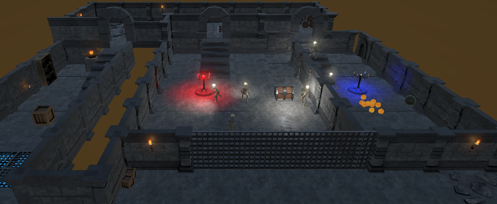
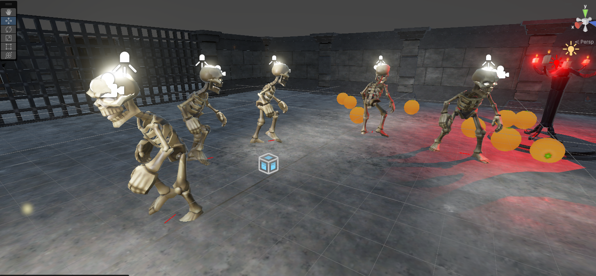
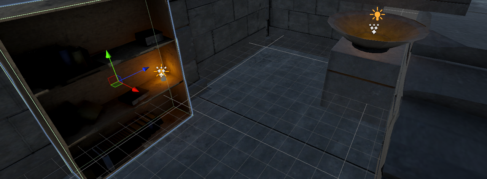
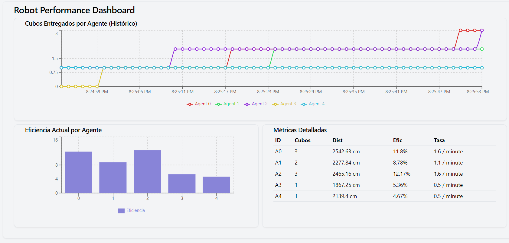
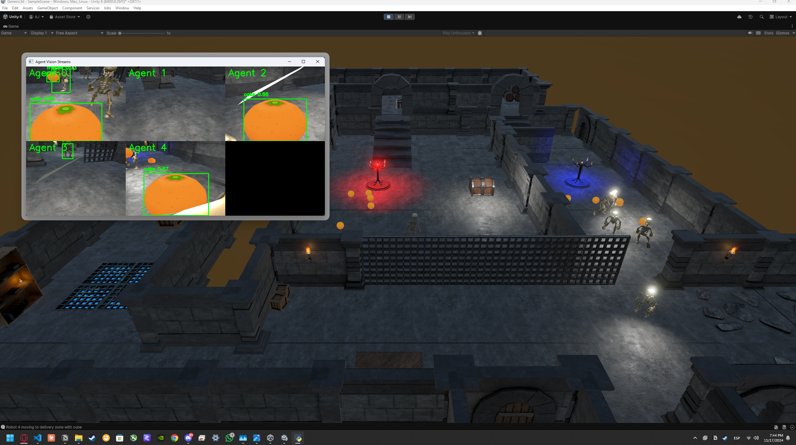

# Multi-Agent System with Computer Vision and 3D Graphics
This project implements a multi-agent system where robotic agents navigate a 3D environment to collect and deliver objects, utilizing computer vision for object detection and autonomous navigation capabilities.


*Complete view of the dungeon environment where the robots operate*

## 📋 Project Overview
The simulation features five robot agents tasked with organizing objects in a structured environment. Each robot uses:
- Computer vision (YOLO v5) for object detection
- Autonomous navigation with NavMesh
- Real-time metrics tracking
- 3D graphics and animations in Unity


*The robot agents working together in the environment*

## 🚀 Project Structure
### Part 1: Multi-Agent System
#### Agent Properties and Environment
- **Agent Type**: Robot Agent
- **Capabilities**:
  - NavMeshAgent-based movement (15 units speed)
  - Collision detection and handling
  - Object manipulation (pick/drop)
  - Inter-agent communication
  - Obstacle jumping (jumpForce = 5f)
  - Animated movement

#### Environment Properties
- NavMesh-defined navigation space
- Two distinct zones:
  - Red Zone (A): Collection area (-15, -1.19, 0)
  - Blue Zone (B): Delivery area (30, -1.19, 0)
- Dungeon environment: ~120 x 25 x 180 units
- 10 randomly distributed cubes in red zone


*Example of dynamic lighting implementation in the environment*

#### Performance Metrics
The system tracks:
1. Cubes Delivered
2. Total Distance Traveled
3. Efficiency Ratio (cubes/distance)
4. Delivery Rate (cubes/minute)


*Real-time performance metrics visualization*

### Part 2: Unity 3D Implementation
Located in `/codes/`:
- `h45.cs`: Individual robot prefab controller
- `robotWorld2.cs`: World controller script
Features:
- Material and texture mapping
- Walking/running animations
- Basic collision detection
- Dynamic lighting

### Part 3: Computer Vision
Located in `/pycodes/`:
- YOLO v5 implementation
- Real-time UDP camera stream processing
- Object recognition system


*YOLO v5 object detection in action*

### Part 4: Metrics Dashboard
Located in `/robot-dashboard/`:
- Real-time visualization of robot performance metrics
- Interactive charts and graphs
- Agent status monitoring

## 📦 Repository Contents
```
├── codes/
│   ├── h45.cs
│   ├── robotWorld2.cs
│   └── [other Unity scripts]
├── pycodes/
│   ├── CameraController.py
│   ├── Controller2.py
│   └── [other Python vision processing scripts]
├── robot-dashboard/
│   ├── src/
│   ├── package.json
│   └── [other web dashboard files]
├── images/
│   ├── dungeon.png
│   ├── robots.png
│   ├── metricas.png
│   ├── luces.png
│   └── yolo.png
├── Documentation.pdf
├── demo.mp4
└── project.unitypackage
```

## 🛠️ Setup and Installation
1. Clone the repository
2. Import the `project.unitypackage` into Unity
3. Set up Python environment with required dependencies
4. Configure YOLO v5 model
5. Start the required controllers:
   ```bash
   # Terminal 1: Start the camera controller
   python CameraController.py

   # Terminal 2: Start the agent controller
   python Controller2.py
   ```
6. Launch the metrics dashboard:
   ```bash
   cd robot-dashboard
   npm install
   npm run dev
   ```
7. Run the Unity simulation

## 🔧 Implementation Details
### Agent Architecture
The robot agents are implemented using a state-machine architecture with the following key components:
- State management
- Navigation control
- Object interaction
- Communication system
- Visual feedback

### Optimization Strategies
Current optimization methods include:
1. Dynamic task allocation
2. Path optimization
3. Collision avoidance
4. Resource management
5. Real-time adaptation

### Future Improvements
Potential enhancements:
1. Advanced path planning
2. Machine learning for behavior optimization
3. Enhanced inter-agent communication
4. Dynamic zone management
5. Improved collision prediction

## 📊 Performance Analysis
The system's performance is measured through:
- Delivery success rate
- Navigation efficiency
- Resource utilization
- Task completion time
Current metrics show varying performance among agents, with A0 and A2 demonstrating the highest efficiency (11.8% and 12.17% respectively).

## 📝 Documentation
Detailed documentation including:
- Class diagrams
- Ontology specifications
- Implementation details
- Performance metrics
Can be found in the Documentation.pdf file.

## 🎥 Demo
A demonstration video (`demo.mp4`) shows the system in action, featuring:
- Agent navigation
- Object manipulation
- Computer vision integration
- Real-time metrics

## 📄 License
[Specify your license here]

## 👥 Contributors
- Christian Fernando Aguilera Santos (A01643407)
- Aarón Hernández Jiménez (A01642529)
- Maxime Parienté (A01764161)
- Pablo Esteban Reyes (A01643307)
- Luis Marco Barriga Baez (A01643954)
- Aram Marco Barriga Baez (A01643954)
